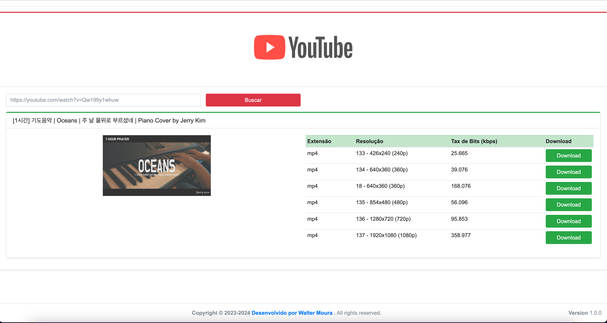

# Sistema de Download de Vídeos do YouTube

## Descrição

Este é um sistema de uso pessoal e para fins de estudo. Com esta aplicação construída em PHP, você será capaz de realizar downloads do YouTube usando `youtube-dlp`. Ao passar uma URL `https://youtube.com/watch?v=<id-video-aqui>`.

**A aplicação fará uma busca e listará os formatos e resoluções disponíveis para download.**

## Instalação

### Requisitos

- Servidor Linux com PHP 8.2+ e Apache instalado
- Alternativamente, você pode usar Docker para rodar a aplicação

### Instalando via Docker

1. **Instale o Docker Desktop:**

    - **Ubuntu:**
      ```
      sudo apt update
      sudo apt install docker.io docker-compose
      sudo systemctl start docker
      sudo systemctl enable docker
      ```

    - **Debian:**
      ```
      sudo apt update
      sudo apt install docker.io docker-compose
      sudo systemctl start docker
      sudo systemctl enable docker
      ```

    - **Fedora:**
      ```
      sudo dnf install docker docker-compose
      sudo systemctl start docker
      sudo systemctl enable docker
      ```

    - **CentOS:**
      ```
      sudo yum install docker docker-compose
      sudo systemctl start docker
      sudo systemctl enable docker
      ```

    - **Windows:**
        1. Baixe e instale o Docker Desktop a partir de [Docker Hub](https://www.docker.com/products/docker-desktop).
        2. Siga as instruções de instalação na tela.

    - **Mac:**
        1. Baixe e instale o Docker Desktop a partir de [Docker Hub](https://www.docker.com/products/docker-desktop).
        2. Siga as instruções de instalação na tela.

2. **Execute o Docker Compose para construir e iniciar os contêineres:**
```
docker compose up
```

3. **Acesse a aplicação:**
   - **Abra seu navegador e acesse [http://localhost:8000/yb-download](http://localhost:8000/yb-download).**
      
   - **Cole a URL do YouTube que deseja fazer o download e clique em buscar**
      
## Arquivo de Configuração `.env`

O arquivo `.env` é utilizado para configurar variáveis importantes da aplicação. Aqui está a descrição dos campos:


- **URL**: Define a URL base do projeto. Normalmente, isso seria `http://localhost:80/yb-download` se estiver rodando localmente.
- **MAINTENANCE**: Define se a aplicação está em manutenção. Pode ser `true` ou `false`.
- **PATH_DOWNLOAD**: Caminho onde os arquivos baixados serão armazenados.
- **PATH_MAIN**: Caminho para a página principal de busca.
- **PATH_DEFAULT_IMG**: Caminho para a imagem padrão.
- **PATH_LOGO_PNG_IASD**: Caminho para o logo PNG da empresa.
- **PATH_LOGO_ICO**: Caminho para o favicon ICO.
- **PATH_LOGO_PNG**: Caminho para o favicon PNG.

## Contribuição

Sinta-se à vontade para contribuir com o projeto. Se encontrar algum problema ou tiver sugestões de melhorias, abra uma issue ou um pull request.

## Licença

Este projeto está licenciado sob a [MIT License](LICENSE).

---

Se precisar de mais informações ou ajuda, consulte a documentação do Docker ou entre em contato com o mantenedor do projeto.
